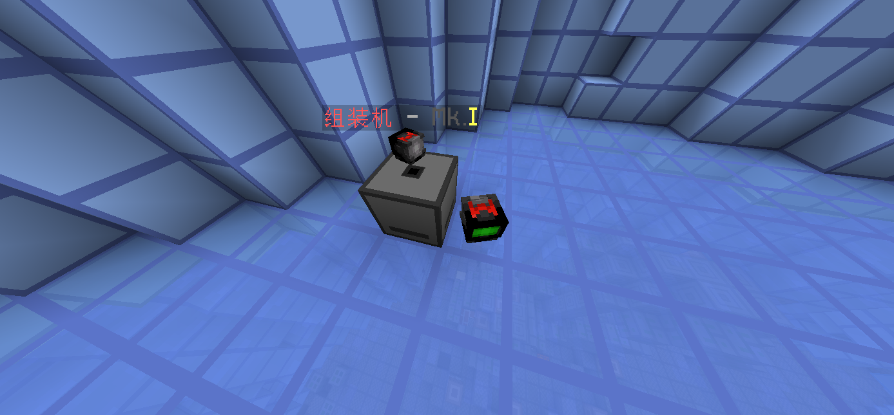
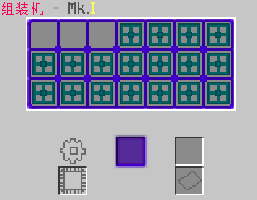
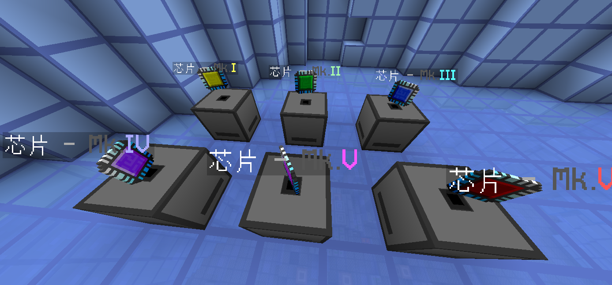
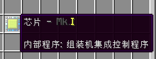
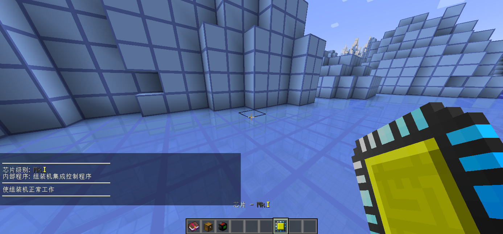
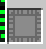

# 前言

`Dumortierite` 采用类似 `Slimefun4` 的科技玩法，但与原版 `Slimefun4` 相比有较大程度的魔改

如果你熟悉 `Slimefun4` 的玩法，将有助于上手

另外请会玩的玩家多帮帮不会玩的...

# 概要

## 合成系统

与原版 `Slimefun4` 不同的一点是，`Dumortierite` 主要合成系统不采用默认的 `强化工作台`，而是使用自己编写的一套蓝图系统

玩家需要在 `组装机` 中放入蓝图和对应的材料，耗费电力合成物品

## 机器和发电机

基本所有机器都需要耗电，不采用多方块机器

所有机器和发电机都需要带有适配该机器的芯片才能运行

和原版 `Slimefun4` 相似，机器和发电机需要接入能源网络才能工作

这部分可以参考原版 `Slimefun4` 的教程

- [能源调度器](https://slimefun-wiki.guizhanss.cn/Energy-Regulator)

- [电容](https://slimefun-wiki.guizhanss.cn/Energy-Capacitors)

- [能源连接器](https://slimefun-wiki.guizhanss.cn/Energy-Connector)

## 芯片

芯片默认是没有程序的

你需要通过 **各种方法** 将程序烧录进芯片

下面是一个烧录了 `组装机集成控制程序` 的芯片

手持芯片，蹲下并按右键可以显示当前程序的详细信息

部分程序需要更高级的芯片才能烧录

比如使用 `芯片 - Mk.II` 烧录 `煤发电机优化马达控制程序` 则会报错

一般来说，高级的程序会带来加工速度的成倍提升

一般来说，机器内有一个特殊的槽位用于放置芯片

再次强调，所有机器和发电机都需要带有适配该机器的芯片才能运行

