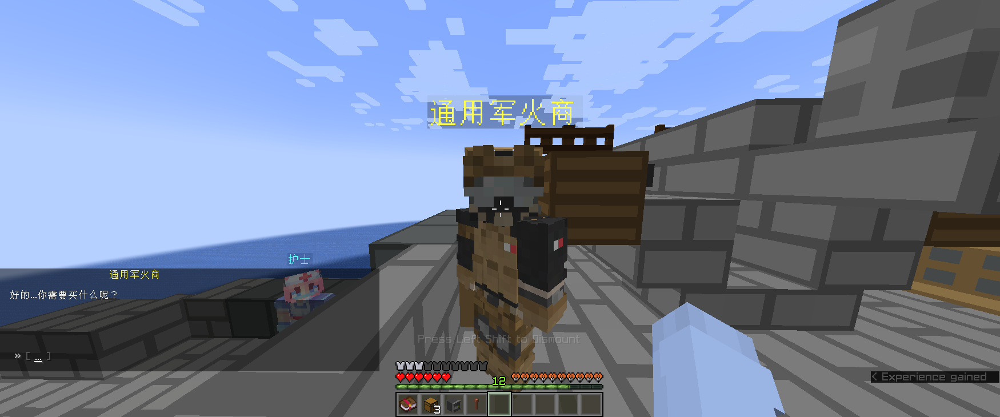

# 前言

本服务器的定位为末日生存服务器，但是在世界观等完善之前，可以将其当作 `AssiahLand` 的附属服务器

目前对于 `AssiahLand` 玩家的主要意义在于，提供新玩法，同时利用服内的货币转换功能获取 `AssiahLand` 的货币

下面根据重要性排序，逐一进行特性介绍

## 死亡掉落

本服除了主城以外的各世界皆为死亡掉落，因此玻璃心慎入

死亡时背包中的物品全部掉落

除了 `灵魂绑定` 的物品（一般灵魂绑定的物品都会在物品说明中阐明）以及 `传呼机`

如果银行中有存款

会扣除 8 到 32 不等的金额

因此前期为了保护资产建议获取的 `绿宝石` 放进末影箱而不是存 `ATM 机` 中（下面会介绍到）

## 经济系统

本服的经济采用 `绿宝石` 作为货币，一个 `绿宝石块` 被视作 9 个 `绿宝石`

击杀怪物会掉落 0 到 3 绿宝石（根据怪物死亡时的装备情况而定，装备越全的怪物掉落越多）

玩家的总财产分为两部分

- 背包内绿宝石总量（包括 `绿宝石` 和 `绿宝石块`）
- 银行存款

目前，船舱底部设有两台 `ATM 机`，方便玩家对银行的存取款

进入 `ATM 机` 的房间后，贴近 `ATM 机`，右键点击打开界面

在执行操作之前

- 首先查看界面中的玩家头颅图标，其中显示的玩家名是否为你本人的名字，这一点决定了存款对象
  如果操作人显示为 “无”，说明你离 `ATM 机` 距离过远，请尽量靠近 `ATM 机`

- 其次检查你身边没有其他玩家，其他玩家也有打开 `ATM 机` 的权限

**如果你提款时有玩家打开了** `ATM 机` **界面，他们可以拿走你提款的** `绿宝石`

界面分为两部分

- 左侧蓝色部分：将绿宝石（块）放入其中会自动存入当前操作人的银行账户
- 右侧黄色部分：
  - 左键 `桶`：从银行中提取 64 E 现金（一组 `绿宝石`）
  - 右键 `桶`：从银行中提取 576 E 现金（一组 `绿宝石块`）

## 从零开始

目前，主城有四个 NPC，下面从左到右分别进行介绍

- 护士：花 5 E 即可恢复你的生命值和饥饿值
    

- 通用军火商：可以购买一些简单的物资，但是售价较贵
    

- 银行职员：将你在 `YetzirahLand` 的存款单向转换成 `AssiashLand` 的货币，汇率会根据兑换情况上下浮动
    

- 船员：给予你新手物品，以及帮助你传送到城市中
    

## 物资获取

城市内的各处箱子都会定时刷新物品

注意只有单个普通箱子（不是大箱子，不是陷阱箱）会刷新物资

**补给箱在被拿空之后才会进入填充状态**

目前从开始填充到填充完毕需要消耗 10 分钟（此数值可能会在后期进行调整）

目前箱子中可以刷到的物资有

- 枪械：包括步枪、冲锋枪、霰弹枪、狙击步枪、火箭筒
- 各种爆炸物
- 护甲：金、铁、锁链、钻石
- 刀具：战术匕首、原版剑
- 食物：生、熟皆有，同时会刷新木炭用于烧制生肉；两种金苹果也有
- 不死图腾
- 绿宝石（块）
- 军用刺激剂，可以用于瞬间回血

## 菜单

第一次于船员见面会赠送 `传呼机`

手持 `传呼机` 右键点击可以打开菜单界面

- 返回上一个死亡地点
    

- 购买车辆
    

- 返回主城
    

**注意在传送的时候不能移动，否则将取消传送，绿宝石不会返还**
